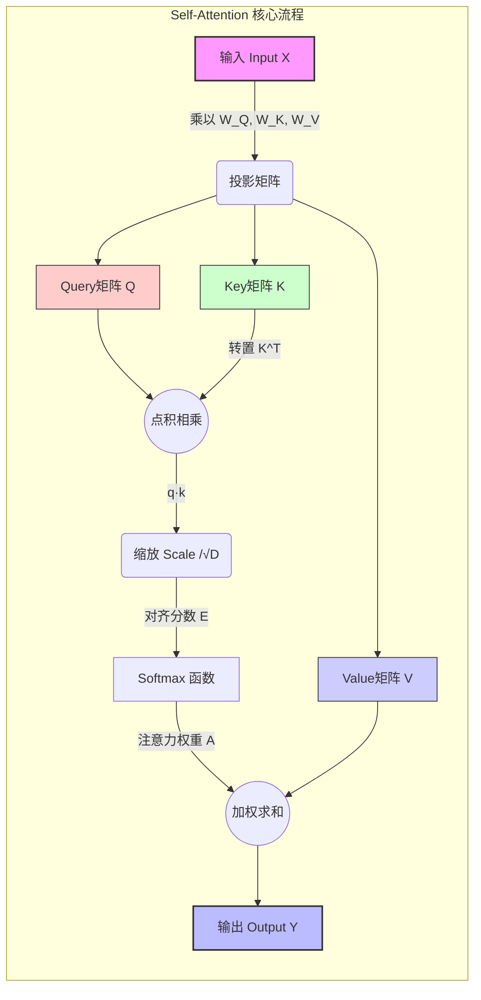
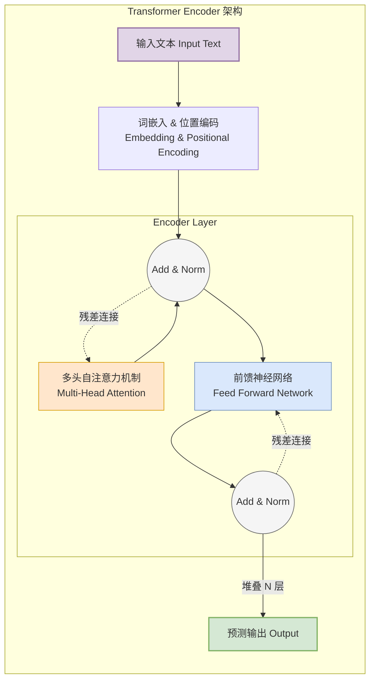

# 📖 附加阅读：加一的聪明大脑是如何理解世界的？—— transformer开天辟地一般的self-attention架构

> **关联章节**：第2章：第一次 LLM API 调用
> **阅读时间**：约 15 分钟

---

## 概述

在第二章中，加一通过 API 调用第一次“睁开双眼”，看到了文字世界。但你是否好奇：加一的“大脑”是如何理解一句话的？为什么它能知道“它”指的是谁？为什么它能写出连贯的文章？

答案就藏在 Transformer 模型的核心机制——**自注意力（Self-Attention）**中。本页将带你深入探索这个“开天辟地”般的架构，让你明白加一（以及所有现代大语言模型）是如何同时关注所有词语，并理解它们之间复杂关系的。

---

## 核心内容

### 1. 产生背景：为什么需要自注意力？

在自注意力出现之前，机器处理序列数据（如一句话）主要依赖两种架构：

- **RNN（循环神经网络）**：像人读书一样逐字阅读，必须读完前面的才能读后面的。问题是：句子长了前面的信息会被“遗忘”，而且无法并行计算，速度慢。
- **CNN（卷积神经网络）**：擅长捕捉局部特征，但像透过一个小窗口看世界，难以建立远距离词语之间的关联。

**核心痛点**：

> “它”到底指谁？

例句：“小明把书给了小红，因为她需要它。”

传统模型很难判断“它”是指“书”还是“小红”。这需要模型同时看到整句话的所有词，并自动判断“它”与“书”的关联更强。

**突破点（2017年 Google《Attention Is All You Need》）**：

自注意力的核心思想极其朴素：让每个词都能直接“看到”句子中所有其他词，并根据相关性决定应该关注谁、忽略谁。

就像开小组讨论会时，每个人（每个词）都拿到了一份参会名单（整个句子），然后自己决定听谁的意见更重要。

---

### 2. 构建思路：从“查字典”到“注意力分配”

自注意力的设计灵感来自信息检索系统：

| 现实场景 | 对应机制 |
|---------|----------|
| 你有一个问题（Query） | 查询向量 q |
| 图书馆有很多书（Key） | 键向量 k |
| 书里有内容（Value） | 值向量 v |
| 你根据问题相关性挑选书籍 | 注意力权重 a |
| 综合多本书的内容作答 | 加权求和输出 y |

**关键创新**：在传统注意力中，Query 来自外部问题，Key/Value 来自被检索的数据库。而自注意力中，Query、Key、Value 都来源于同一个输入序列——自己查自己，所以叫“Self（自）”。

---

### 3. 技术细节原理：图解中的六个公式

让我们对照图片，逐层拆解：

#### 输入层

Input vectors: x (shape: N × D)
- N：序列长度（如句子有 3 个词，N=3）
- D：每个词的向量维度（如 512 维）
- 图中示例：x₀, x₁, x₂ 代表 3 个输入词

#### 第一步：生成 Q、K、V（三个投影变换）

$$ K = X W_k $$
$$ V = X W_v $$
$$ Q = X W_q $$

**原理**：
- 每个输入词 x 分别乘以三个可学习的权重矩阵 W_k、W_v、W_q
- 相当于把同一个词投影到三个不同的“语义空间”
  - Query（查询）：表示“我想找什么信息”
  - Key（键）：表示“我有什么信息可供匹配”
  - Value（值）：表示“我实际携带的内容是什么”

**类比**：你（Query）去招聘会，每个展位有岗位描述（Key）和实际工作内容（Value）。你根据岗位描述匹配度决定关注哪个展位。

#### 第二步：计算对齐分数（Alignment）

Alignment: $e_{i,j} = \frac{q_j \cdot k_i}{\sqrt{D}}$

**原理**：
- 图中 e₀₀, e₀₁...e₂₂ 构成一个 3×3 的分数矩阵
- e{i,j} 表示：第 j 个词作为 Query，对第 i 个词的 Key 的兴趣度
- 使用点积（·）衡量向量相似度：方向越一致，分数越高
- 除以 √D（缩放因子）：防止维度太高时点积值过大，导致 softmax 梯度消失

**图中示例**：
- q₀ 与 k₀, k₁, k₂ 分别计算，得到 e₀₀, e₀₁, e₀₂
- 这表示“词 0 应该分别给词 0、1、2 多少注意力”

#### 第三步：Softmax 归一化（Attention 权重）

Attention: $a_{i,j} = \text{softmax}(e_{i,j})$

**原理**：
- 对每一列（每个 Query 对应的分数）做 softmax
- 将分数转换为概率分布：所有权重之和为 1
- 确保每个词“注意力预算”有限，必须合理分配

**图中黄色矩阵 a{i,j}**：
- a₀₀=0.5, a₀₁=0.3, a₀₂=0.2 表示：词 0 在生成自己的新表示时，50% 关注自己，30% 关注词 1，20% 关注词 2

#### 第四步：加权聚合（Output）

Output: $y_j = \sum_{i} a_{i,j} v_i$

**原理**：
- 每个输出 y_j 是所有 Value 的加权平均
- 权重就是上一步算出的注意力分数 a{i,j}

**图中 “mul(→) + add(↑)” 的含义**：
- mul(→)：横向乘法，a{i,j} × v_i（注意力权重乘以对应值向量）
- add(↑)：纵向求和，把加权后的结果加起来

**最终结果**：
- y₀, y₁, y₂ 是全新的上下文向量
- 每个 y 都融合了整个句子的信息，但融合比例不同

---

### 4. 全链路工作流程（以图中 3 词句子为例）

输入: $X = [x_0, x_1, x_2]$ (分别对应 "我", "喜欢", "AI")

**1. 线性投影**

$$
Q = \begin{bmatrix} q_0 \\\\ q_1 \\\\ q_2 \end{bmatrix}, 
K = \begin{bmatrix} k_0 \\\\ k_1 \\\\ k_2 \end{bmatrix}, 
V = \begin{bmatrix} v_0 \\\\ v_1 \\\\ v_2 \end{bmatrix}
$$

**2. 计算相似度 (点积)**

$$
E = \frac{Q K^T}{\sqrt{D}} = \begin{bmatrix} 
e_{00} & e_{01} & e_{02} \\\\
e_{10} & e_{11} & e_{12} \\\\
e_{20} & e_{21} & e_{22} 
\end{bmatrix}
$$

*(注：$e_{ij}$ 表示 $q_i$ 与 $k_j$ 的匹配度)*

**3. Softmax 归一化**

$$
A = \text{softmax}(E) = \begin{bmatrix} 
a_{00} & a_{01} & a_{02} \\\\
a_{10} & a_{11} & a_{12} \\\\
a_{20} & a_{21} & a_{22} 
\end{bmatrix}
$$

*(注：每行的概率之和为 1)*

**4. 加权聚合 Value**

$$
Y = A V = \begin{bmatrix} 
a_{00}v_0 + a_{01}v_1 + a_{02}v_2 \\\\
a_{10}v_0 + a_{11}v_1 + a_{12}v_2 \\\\
a_{20}v_0 + a_{21}v_1 + a_{22}v_2 
\end{bmatrix} = \begin{bmatrix} y_0 \\\\ y_1 \\\\ y_2 \end{bmatrix}
$$

输出 $Y$ 就是融入了整句语境后的新表示矩阵（形状: $N \times D_v$）。

---

### 5. 系统能解决什么问题？

#### 核心能力

| 能力 | 说明 |
|------|------|
| 长距离依赖 | 句子首尾词可以直接交互，无论相隔多远 |
| 并行计算 | 所有词的注意力同时计算，不像 RNN 必须串行 |
| 可解释性 | 注意力权重 a{i,j} 直观展示模型“在看哪里” |
| 上下文感知 | 同一个词在不同句子中生成不同的表示（如“bank”在“river bank”和“bank account”中含义不同） |

#### 对比传统方法

| 特性 | RNN | CNN | Self-Attention |
|------|-----|-----|----------------|
| 长距离依赖 | ❌ 易遗忘 | ⚠️ 需多层堆叠 | ✅ 直接连接 |
| 并行度 | ❌ 串行 | ✅ 并行 | ✅ 完全并行 |
| 位置信息 | 天然有序 | 局部有序 | ⚠️ 需额外编码 |
| 计算复杂度 | O(N) | O(N·logN) | O(N²) |

> 注：Self-Attention 的 O(N²) 复杂度是主要缺点，因此出现了各种高效注意力变体（如线性注意力、稀疏注意力）。

---

### 6. 实际应用场景

#### 自然语言处理（NLP）
- 机器翻译：“Attention Is All You Need” 最初就是为翻译任务设计的
- 文本摘要：模型自动关注原文关键句
- 情感分析：识别“不是很喜欢”中“不”对“喜欢”的否定作用
- 问答系统：从长文档中定位答案所在片段

#### 计算机视觉
- ViT（Vision Transformer）：将图像切分为小块（patch），用自注意力建模全局关系
- 图像生成：Stable Diffusion 中的 Cross-Attention 控制文本到图像的生成

#### 多模态与跨领域
- CLIP：图像和文本共享注意力空间，实现跨模态检索
- GPT-4V：看图说话，视觉 token 和文本 token 统一用注意力交互

#### 科学计算
- AlphaFold2：用注意力机制预测蛋白质三维结构，关注氨基酸残基间的空间关系
- 分子性质预测：注意力权重揭示原子间关键化学键

---

### 7. 总结：一张图看懂 Transformer 的灵魂

这张图展示的是 Transformer 模型中 Encoder 层的核心运算单元。整个大模型就是由这样的模块堆叠几十层构建的：

**最本质的洞察**：

> 自注意力没有引入任何先验假设（如“左边词更重要”），完全通过数据学习“该关注谁”。这种极简而强大的归纳偏置，配合海量数据和算力，催生了今天的 AI 革命。

---

## 实践练习

### 练习 1：实现简单的自注意力计算

用 Python 实现一个简化版的自注意力计算，帮助你直观理解其工作原理。

**任务**：
1. 给定三个词向量（随机生成）
2. 随机初始化 Q, K, V 的权重矩阵
3. 计算注意力权重
4. 输出加权聚合的结果

**提示**：使用 NumPy 库，重点关注矩阵乘法和 Softmax 函数的实现。

### 练习 2：阅读原始论文

阅读 2017 年 Google 的论文《Attention Is All You Need》，回答以下问题：
1. 论文中提出的 Transformer 模型主要解决了什么问题？
2. 为什么作者说“Attention is all you need”？
3. 论文中除了自注意力，还提出了哪些重要概念？

---

## 延伸阅读

- [Attention Is All You Need（原始论文）](https://arxiv.org/abs/1706.03762)
- [The Illustrated Transformer（可视化讲解）](https://jalammar.github.io/illustrated-transformer/)
- [Transformer 论文逐段精读（中文视频）](https://www.bilibili.com/video/BV1pu411o7BE/)
- [自注意力机制的直觉理解（博客）](https://lilianweng.github.io/posts/2018-06-24-attention/)
- [多头注意力机制详解](https://d2l.ai/chapter_attention-mechanisms/multihead-attention.html)

---

**← 返回第 2 章：[加一睁开双眼 — 第一次 LLM API 调用](/ch02/)**